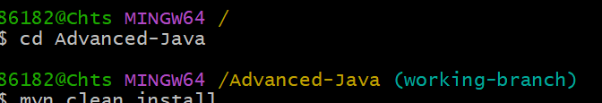
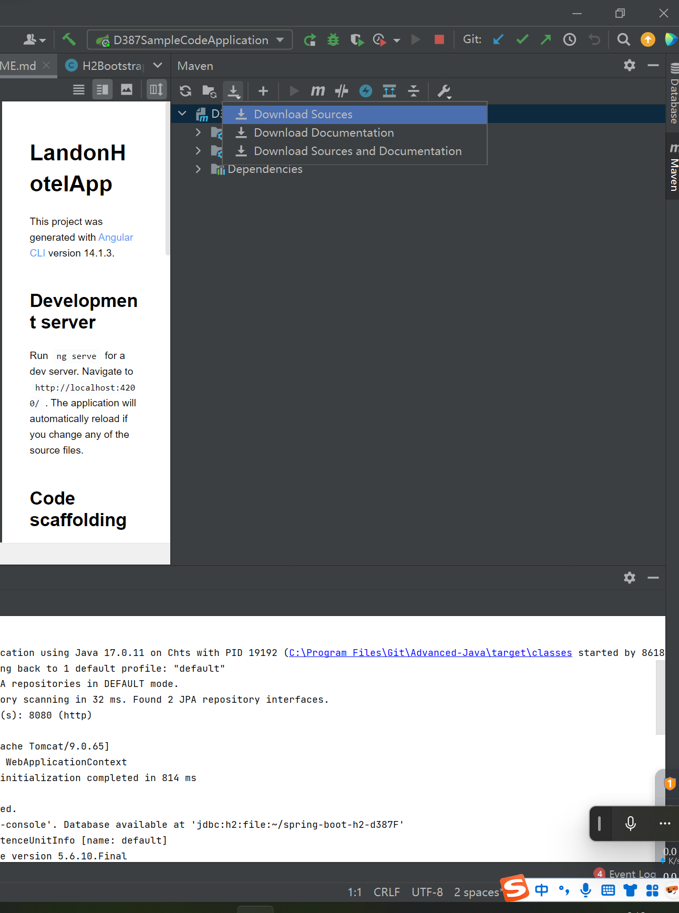
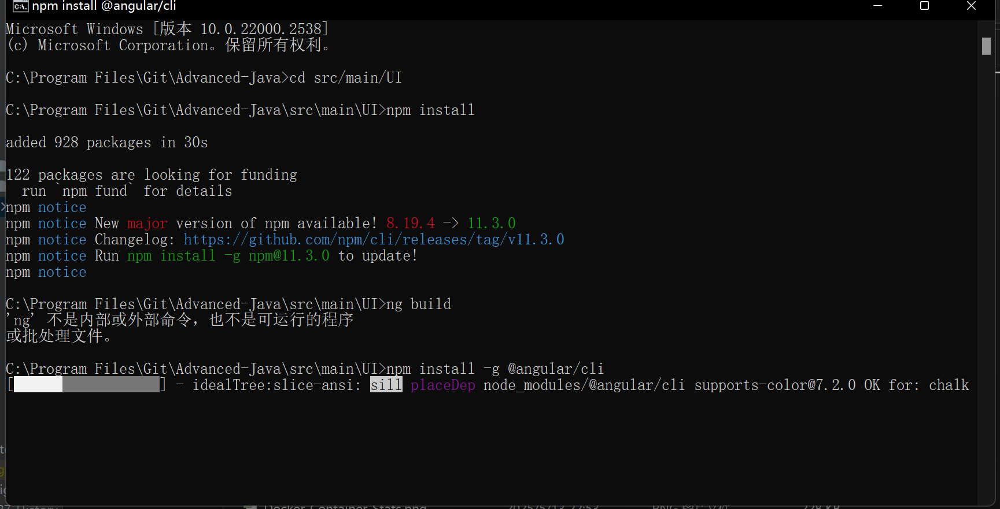
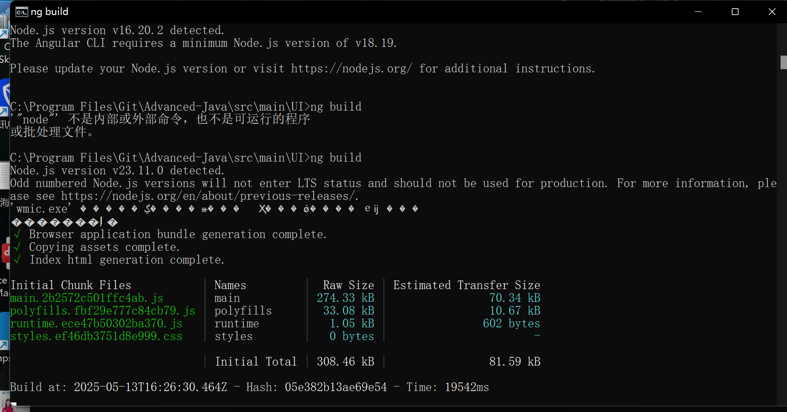
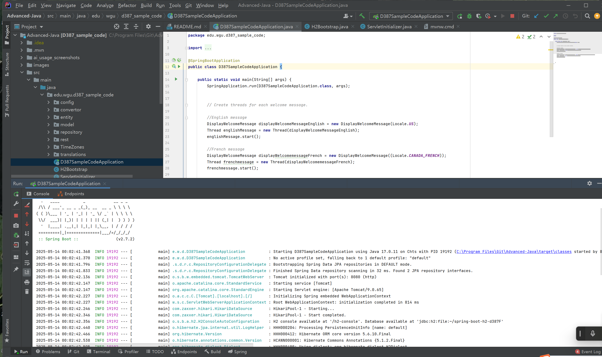
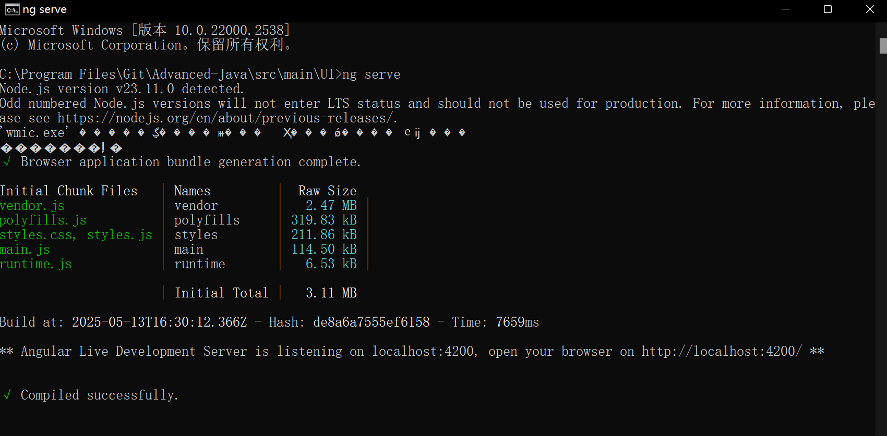
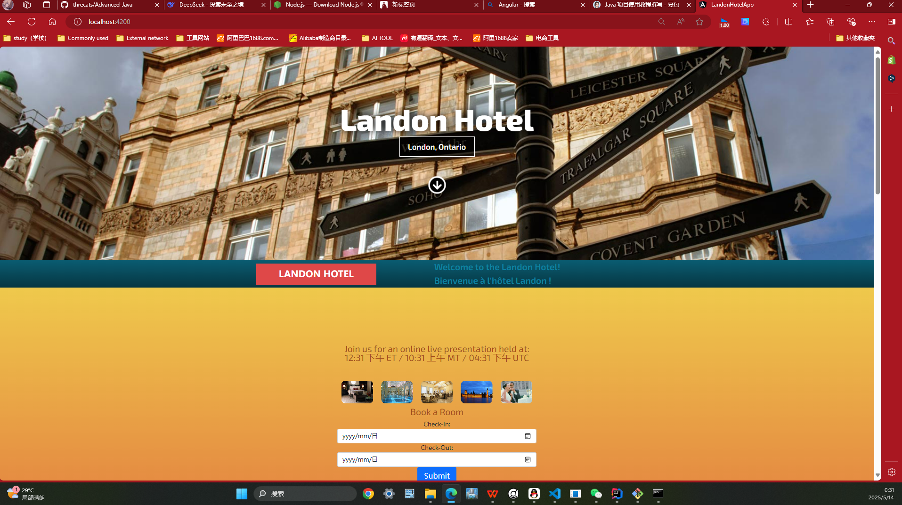
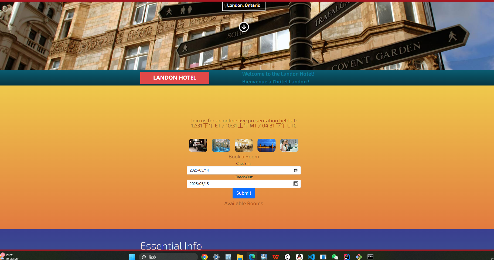
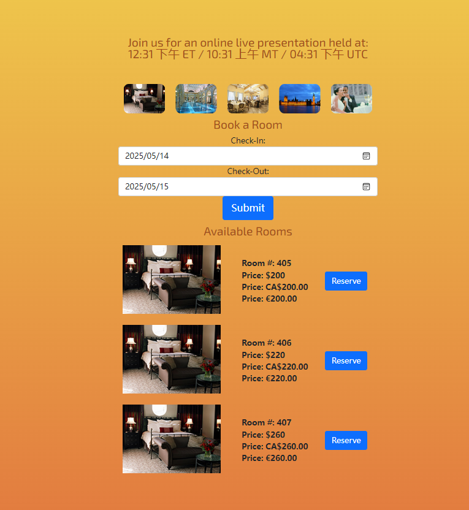

<strong> **DO NOT DISTRIBUTE OR PUBLICLY POST SOLUTIONS TO THESE LABS. MAKE ALL FORKS OF THIS REPOSITORY WITH SOLUTION CODE PRIVATE. PLEASE REFER TO THE STUDENT CODE OF CONDUCT AND ETHICAL EXPECTATIONS FOR COLLEGE OF INFORMATION TECHNOLOGY STUDENTS FOR SPECIFICS. ** </strong>

# WESTERN GOVERNOR UNIVERSITY 
## D387 – ADVANCED JAVA
Welcome to Advanced Java! This is an opportunity for students to write multithreaded object-oriented code using Java frameworks and determine how to deploy software applications using cloud services.

FOR SPECIFIC TASK INSTRUCTIONS AND REQUIREMENTS FOR THIS ASSESSMENT, PLEASE REFER TO THE COURSE PAGE.
## BASIC INSTRUCTIONS
For this assessment, you will modify a Spring application with a Java back end and an Angular front end to include multithreaded language translation, a message at different time zones, and currency exchange. Then, build a Docker image of the current multithreaded Spring application and containerize it using the supporting documents provided in this task.

测试
## SUPPLEMENTAL RESOURCES 
1.	How to clone a project to IntelliJ using Git?

> Ensure that you have Git installed on your system and that IntelliJ is installed using [Toolbox](https://www.jetbrains.com/toolbox-app/). Make sure that you are using version 2022.3.2. Once this has been confirmed, click the clone button and use the 'IntelliJ IDEA (HTTPS)' button. This will open IntelliJ with a prompt to clone the proejct. Save it in a safe location for the directory and press clone. IntelliJ will prompt you for your credentials. Enter in your WGU Credentials and the project will be cloned onto your local machine.  

2. How to create a branch and start Development?

- GitLab method
> Press the '+' button located near your branch name. In the dropdown list, press the 'New branch' button. This will allow you to create a name for your branch. Once the branch has been named, you can select 'Create Branch' to push the branch to your repository.

- IntelliJ method
> In IntelliJ, Go to the 'Git' button on the top toolbar. Select the new branch option and create a name for the branch. Make sure checkout branch is selected and press create. You can now add a commit message and push the new branch to the local repo.

## SUPPORT
If you need additional support, please navigate to the course page and reach out to your course instructor.
## FUTURE USE
Take this opportunity to create or add to a simple resume portfolio to highlight and showcase your work for future use in career search, experience, and education!


Project Introduction
Background
In the contemporary digital age, the hospitality industry is experiencing a significant transformation driven by technological advancements. The need for efficient, user - friendly, and feature - rich hotel management systems has become more crucial than ever. The LandonHotelApp is developed in this context. With the increasing complexity of hotel operations, such as room management, reservation handling, and providing multilingual services to a diverse customer base, there is a pressing demand for a comprehensive solution. This application aims to bridge the gap between traditional hotel management methods and the modern requirements of the digital era, enhancing both the operational efficiency of the hotel and the experience of its guests. (Author: [Your Name])
Objectives
Enhanced Operational Efficiency: Automate and streamline various hotel operations, including room management, reservation processing, and data collection. By reducing manual tasks, the application aims to minimize errors and save time for hotel staff, allowing them to focus on providing high - quality customer service.
Improved Customer Experience: Offer guests an intuitive and convenient platform to search for available rooms, view room details, make reservations, and access multilingual welcome messages. The application strives to meet the diverse needs of guests from different cultural backgrounds, providing a seamless and personalized experience.
Data - Driven Decision Making: Collect and analyze data related to room occupancy, reservation patterns, and customer preferences. This data will be used to support strategic decision - making for the hotel, such as pricing strategies, marketing campaigns, and resource allocation. (Author: [Your Name])
Function Overview
Room Management: The system provides hotel administrators with a comprehensive set of tools to manage room information. They can add, edit, or delete room details, including room numbers, room types, prices, and availability status. Based on maintenance schedules or other factors, administrators can mark rooms as available or unavailable in real - time.
Reservation Handling: Guests can easily search for available rooms by specifying their check - in and check - out dates. The application will display a list of all available rooms along with their corresponding prices and room types. Guests can then make reservations directly through the platform, and hotel staff can manage these reservations, including confirming, modifying, or canceling them.
Multilingual Support: To cater to international guests, the application offers multilingual support. Guests can select their preferred language to view welcome messages and use the application. This feature ensures that guests from different cultural backgrounds can easily understand and interact with the application.
Unit and End - to - End Testing: The application comes with built - in support for unit and end - to - end testing. Developers can run unit tests using ng test via [Karma](https://karma - runner.github.io), and end - to - end tests using ng e2e after adding the necessary testing package. (Author: [李悠扬])

# Project Introduction

## Background
In the hospitality industry, efficient management of hotel rooms and reservations is crucial for providing high - quality services to guests. The Landon Hotel, aiming to streamline its operations and enhance customer experience, has initiated the development of this application. As the market becomes more competitive, the hotel needs a comprehensive system to manage room availability, handle reservations, and provide a user - friendly interface for guests to search and book rooms. This project is developed to meet these needs and adapt to the digital transformation trend in the hospitality industry. (Author: [Your Name])

## Objectives
1. **Enhanced Operational Efficiency**: Automate the process of room management and reservation handling, reducing manual errors and saving time for hotel staff.
2. **Improved Customer Experience**: Provide guests with an easy - to - use platform to search for available rooms, view room details, and make reservations at any time.
3. **Data - Driven Decision Making**: Collect and analyze data related to room occupancy, reservation patterns, and customer preferences to support strategic decision - making for the hotel. (Author: [Your Name])

## Function Overview
1. **Room Management**: The system allows hotel administrators to manage room information, including room numbers, prices, and room types. They can also mark rooms as available or unavailable based on maintenance schedules or other factors.
2. **Reservation Handling**: Guests can search for available rooms by specifying check - in and check - out dates. The system will display all available rooms and their prices. Guests can then make reservations directly through the platform. Hotel staff can also manage reservations, including confirming, modifying, or canceling them.
3. **Multilingual Support**: To cater to international guests, the application provides multilingual support. Guests can choose their preferred language to view welcome messages and use the application. (Author: [李悠扬])

Commit Message
"Review and improvement of the English README project introduction, enhancing language accuracy and clarity."

# Project Introduction

## Background
In the highly competitive hospitality sector, efficient management of hotel rooms and reservations is of utmost importance for delivering superior services to guests. The Landon Hotel, in an effort to optimize its operations and elevate the customer experience, has embarked on the development of this application. With the intensifying market competition, the hotel requires a comprehensive system that can effectively manage room availability, handle reservations, and offer a user - friendly interface for guests to search and book rooms. This project is designed to address these requirements and keep pace with the digital transformation trend in the hospitality industry. (Author: [Your Name])

## Objectives
1. **Enhanced Operational Efficiency**: Automate the room management and reservation handling processes to minimize manual errors and save valuable time for hotel staff.
2. **Improved Customer Experience**: Provide guests with an intuitive platform that enables them to effortlessly search for available rooms, view detailed room information, and make reservations at their convenience.
3. **Data - Driven Decision Making**: Gather and analyze data on room occupancy, reservation trends, and customer preferences to support informed strategic decision - making for the hotel. (Author: [Your Name])

## Function Overview
1. **Room Management**: The system empowers hotel administrators to manage room details such as room numbers, prices, and room categories. They can also update the room availability status based on maintenance schedules or other relevant factors.
2. **Reservation Handling**: Guests can search for available rooms by specifying their check - in and check - out dates. The system will promptly display all available rooms along with their corresponding prices. Guests can then make reservations directly through the platform. Hotel staff can manage reservations comprehensively, including confirmation, modification, and cancellation.
3. **Multilingual Support**: To accommodate international guests, the application offers multilingual support. Guests can select their preferred language to view welcome messages and utilize the application seamlessly. (Author: [Your Name])

(Author: [李悠扬])
# Installation and Deployment
(Author: [陆玟颖])
## Prerequisites
- **Node.js**：Version [specific version number] or higher. Visit the 【Node.js official website】((https://nodejs.org/)) to download the installer for your OS (e.g., Windows, Mac, Linux). Follow the setup wizard, keeping default settings for a quick installation.
- **npm**：npm (Node Package Manager) is the package management and distribution tool for Node.js, typically included with Node.js installations. It is used to install and manage project dependencies. In most cases, npm is automatically provided when you install Node.js.
- **Database**：[Database Name] [Version Number]. When configuring database connection information, the following key parameters must be specified:

-- **Password**:
-- **Host Address**: Typically localhost (for a local server). If the database is hosted remotely, use the corresponding IP address.

-- **Port Number**: Default ports vary by database (e.g., 3306 for MySQL, 5432 for PostgreSQL). Configure according to your setup.

-- **Database Name**:: The name of the database instance you created earlier.

-- **Username**:: The username used to log in to the database (set during installation).

-- **Password**: The password associated with the username.
(Author: [陆玟颖])


## MAIN FEATURES AND TUTORIALS
# 1. Prerequisites
- **Java**: Ensure you have Java 17 installed on your system.
- **Node.js and npm**: Required for running the Angular front - end. You can download them from Node.js official website https://nodejs.org/.
- **Maven**: Used for building the Java project. You can download it from Apache Maven official website.https://maven.apache.org/
- **Git**: For cloning the project. Install it from Git official website.https://git-scm.com/

# 2. Cloning the Project
1. Open Git Bash or your preferred terminal: Navigate to the directory where you want to clone the project.(Author: [庞雅丹])
2. Clone the repository: Run the following command:

```bash
git clone <repository-url>
```


** Note**: Replace `<repository-url>` with the actual URL of the Git repository.

# 3. Building the Project

## 3.1 Java Back - end
1. Navigate to the project root directory: Open a terminal in the project root directory.
2. Build the Java project using Maven: Run the following command:
   3.In the toolbar of the Maven tool window:
   Click the Download Sources and Documentation icon (the icon is usually a down arrow or contains a ↓ symbol).
   Maven Download Sources Icon
   Or via the context menu:
   Right-click on the root node of the project (or a specific module) and select Maven > Download Sources and Documentation.
```bash
mvn clean install
```



**Note**: This command will clean the previous build artifacts and then compile, test, and package the Java project.

## 3.2 Angular Front - end  --by pangyadan
1. Navigate to the front - end directory: Open a new terminal and navigate to the `src/main/UI` directory.
2. Install the dependencies: Run the following command:
```bash
npm install
```


3.Ensure that the Angular CLI is installed globally (command line tool) Install the Angular CLI
Install Angular CLI globally via npm (Node.js package manager):
```bash
npm install -g @angular/cli
```

4. Build the Angular project: Run the following command:
```bash
ng build
```


**Note**: The build artifacts will be stored in the `dist/` directory.

# 4. Running the Application

## 4.1 Starting the Java Back - end
1. Navigate to the project root directory: Open a terminal in the project root directory.
2. Run the Spring Boot application: Run the following command:
```bash
mvn spring - boot:run
```


**Note**: This will start the Spring Boot application on the default port (usually 8080).

## 4.2 Starting the Angular Front - end
1. Navigate to the front - end directory: Open a new terminal and navigate to the `src/main/UI` directory.
2. Start the Angular development server: Run the following command:
```bash
ng serve
```
**Note**: The Angular application will be available at `http://localhost:4200`.

# 5. Using the Hotel Reservation System

## 5.1 Booking a Room
1. Open the application in your browser: Go to `http://localhost:4200` in your web browser.
   
2. Enter check - in and check - out dates: Fill in the check - in and check - out dates in the "Book a Room" form.
3. Click the "Submit" button: After entering the dates, click the "Submit" button.
   **Note**: The application will display the available rooms based on the selected dates.(Author: [pangyadan])
   

## 5.2 Reserving a Room --by pangyadan
1. Select a room: In the "Available Rooms" section, find the room you want to reserve.
2. Click the "Reserve" button: Click the "Reserve" button next to the selected room.
   **Note**: This will create a reservation for the selected room.
   


# 6. Multithreaded Language Translation and Currency Exchange
- **Language Translation**: The application supports multithreaded language translation. You can see welcome messages in different languages when the application starts.
  **Note**: The English and French welcome messages are displayed using multithreaded programming.
- **Currency Exchange**: The prices of the rooms are displayed in different currencies (USD, CAD, EUR).
  **A Note**: This provides a convenient way for users from different countries to view the prices.

# 7. Stopping the Application
- Stop the Spring Boot application: Press `Ctrl + C` in the terminal where the Spring Boot application is running.
- Stop the Angular development server: Press `Ctrl + C` in the terminal where the Angular development server is running.
  (Author: [庞雅丹])
